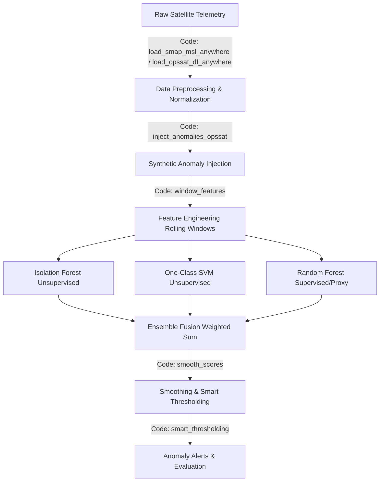
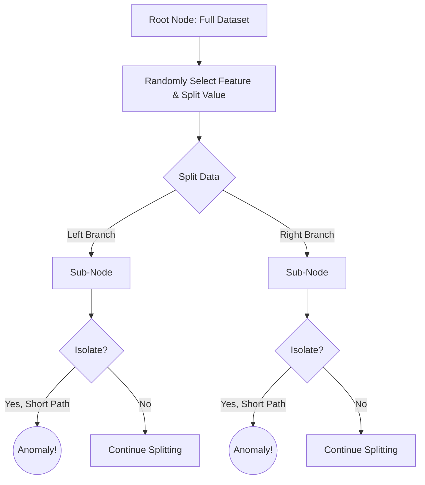
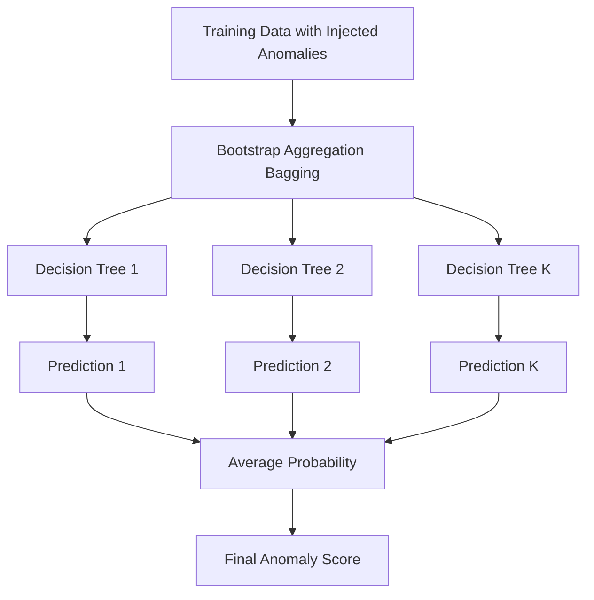
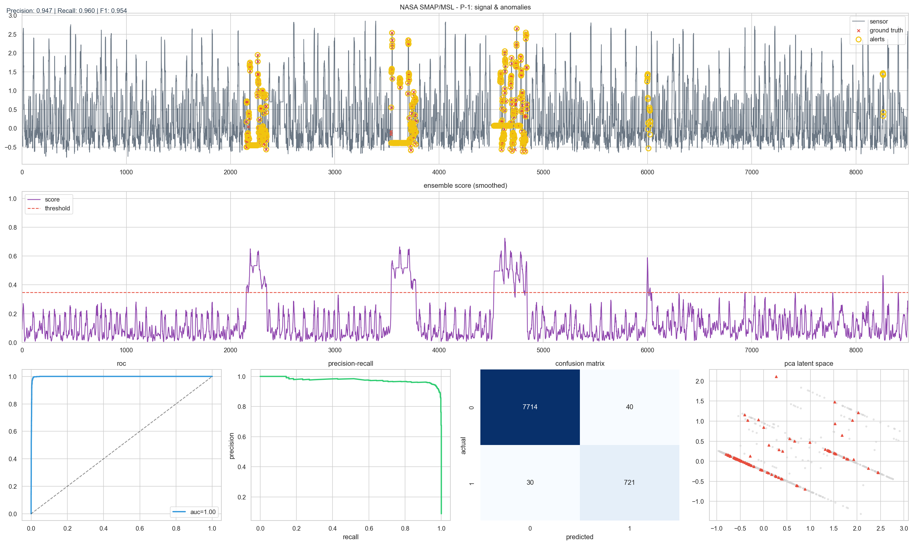
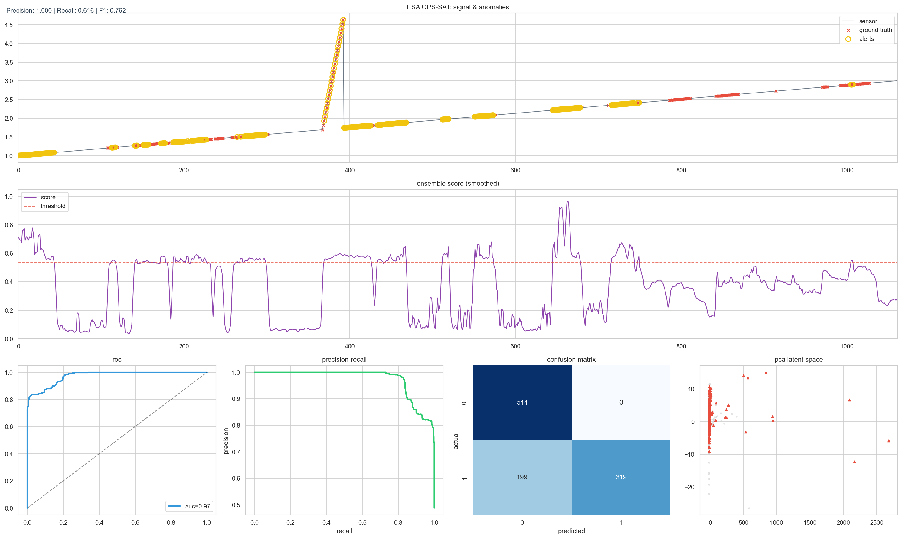
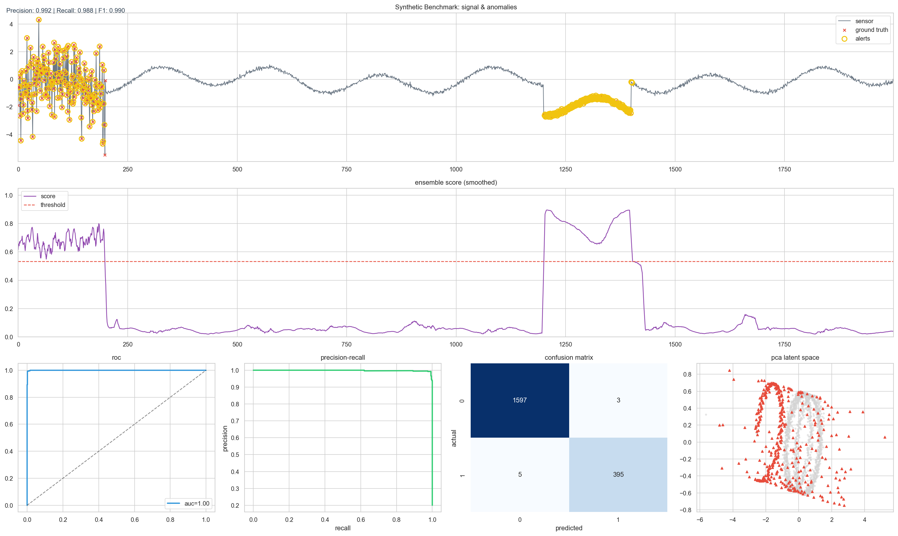
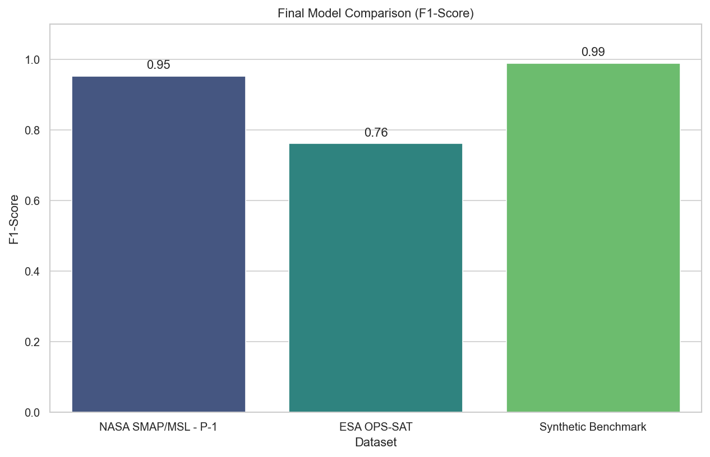

# Anomaly detection in satellite telemetry data using Machine Learning

**Authors**: Anushka Kumari¹*†, Aditya K. V.¹†, Chakali Jayasree¹†, Adidev V. K.¹†  
¹Department of Computer Science & Engineering, Apex Institute of Technology, Chandigarh University, Gharuan, Punjab 140413, India  
*Corresponding author: anushka70616@gmail.com | Contributing authors: adityakvnov05@gmail.com, janujayasree17@gmail.com, adidevvk@gmail.com  
†These authors contributed equally to this work.

---

## 📄 Abstract
Satellite Networks always keep changing because they are always moving around the earth or some specific planets. Communication between resources in space and on Earth is limited and very costly, so it’s very important to detect any anomaly in satellite telemetry data as early as possible. The fault detection methods used in this paper are mainly based on Machine Learning parts. Traditional methods are not enough to detect the behavior of satellites, so new technologies are developed to identify faults in satellites, which is enough to avoid the money, time, data and mission loss and any system failures. In this research paper, Machine Learning techniques are used to deal with very large and complex data. This paper first learns what normal satellite behavior looks like and then automatically identifies any abnormal patterns in that. Experimental results show how these methods can accurately detect faults early and improve the reliability of satellite systems.

---

## 🚀 How to Run It

### Prerequisites
Ensure you have Python installed along with the required libraries.
```bash
pip install pandas numpy matplotlib seaborn scikit-learn
```

### Execution
Run the main script:
```bash
python script.py
```
Upon execution, the script will:
1. Load the telemetry datasets from the `data/` directory.
2. Generate synthetic data for benchmarking.
3. Apply the anomaly detection pipeline.
4. Output terminal logs.
5. Generate an interactive, styled HTML report (`report.html`) containing all logs and visualization plots, which will automatically open in your default web browser.

---

## 🛠️ Methodological Workflow

The hybrid ensemble model consists of three components:
1. A Random Forest (RF) classifier trained on nominal data and injected anomalies.
2. A One-Class SVM (OCSVM) novelty detector.
3. An Isolation Forest (IF) outlier detector. 

An ensemble anomaly score is formed by aggregating the anomaly scores assigned by each component. To identify whether a given time point is anomalous, we threshold the ensemble score after applying a smoothing filter.

### Flowchart: Satellite Anomaly Detection System Pipeline


---

## 🧠 Explanation of Models Used (Mathematics & Code)

### 1. Isolation Forest (IF)
**Concept**: Detects anomalies by randomly partitioning the data space and observing how quickly individual samples become isolated in a tree structure. Anomalies, being few and different, are easier to isolate (they tend to have shorter path lengths).

**Mathematics**: The anomaly score $s(x, n)$ for an observation $x$ given a sample size $n$ is defined as:

$$
s(x, n) = 2^{-\frac{E(h(x))}{c(n)}}
$$

Where $h(x)$ is the path length of observation $x$, $E(h(x))$ is the expected path length, and $c(n)$ is the average path length of an unsuccessful search in a Binary Search Tree. As $s(x,n) \to 1$, the instance is more likely an anomaly.



### 2. One-Class SVM (OCSVM)
**Concept**: Learns a decision boundary around normal data, classifying points outside that boundary as anomalies. We use an RBF-kernel One-Class SVM trained only on data from normal operating periods.

**Mathematics**: It solves the following optimization problem:

$$
\min_{w, \xi, \rho} \frac{1}{2} ||w||^2 + \frac{1}{\nu l} \sum_{i=1}^l \xi_i - \rho
$$

Subject to: $(w \cdot \Phi(x_i)) \ge \rho - \xi_i$ and $\xi_i \ge 0$.
Here, $\nu$ roughly controls the expected anomaly fraction, and $\Phi(x)$ is the non-linear feature mapping (RBF Kernel).

### 3. Random Forest Classifier (RF)
**Concept**: We inject synthetic anomalies into the training data and label these injected data points as anomalies. This allows the Random Forest to learn discriminative features that distinguish nominal telemetry from anomalous telemetry.

**Mathematics**: The RF builds $K$ decision trees. For a new instance $x$, the predicted probability of it being an anomaly is the average over all trees:

$$
P(y=1 | x) = \frac{1}{K} \sum_{k=1}^K P_k(y=1 | x)
$$



### 4. Ensemble Fusion & Smart Thresholding
**Code Functions**: `smooth_scores()`, `apply_persistence_rule()`, `smart_thresholding()`

**Mathematics**: The normalized scores are fused into a final score:

$$
S_{final} = w_1 S_{IF} + w_2 S_{SVM} + w_3 S_{RF}
$$

Then, a moving average filter is applied to eliminate transient spikes:

$$
\hat{S}_t = \frac{1}{W} \sum_{i=t-W/2}^{t+W/2} S_{final, i}
$$

A persistence rule is applied such that an alert is only triggered if $\hat{S}_t > \text{Threshold}$ for $k$ consecutive time steps.

---

## 💻 Code Architecture Overview

- **Data Ingestion & Preprocessing**: Functions like `load_smap_msl_anywhere` and `load_opssat_df_anywhere` handle the loading of `.npy` and `.csv` files.
- **Anomaly Injection**: The `inject_anomalies_opssat` function artificially injects contextual and point anomalies (spikes, drifts, dropouts, noise bursts).
- **Feature Engineering**: Functions `make_rolling_features_1d` and `window_features` compute rolling metrics (mean, std, min, max, median, quantiles, energy).
- **Output Generation**: Utilizes an integrated **HTML Logger** inside `script.py` which intercepts `print()` statements and Base64 encodes `matplotlib` plots to generate a dynamic `report.html` file.

---

## 📊 Outputs & Visualizations

Below are the dashboard outputs generated by the pipeline for each dataset. The dashboards feature:
- Signal tracing alongside ground truth and predicted alerts.
- Smoothed ensemble anomaly scores.
- ROC and Precision-Recall curves.
- Confusion matrices and PCA latent space visualizations.

### 1. NASA SMAP/MSL
*(Achieved F1: ~0.96, Precision: ~0.95)*


### 2. ESA OPS-SAT (Injected Labels)
*(Achieved F1: ~0.76, Precision: ~0.998)*


### 3. Synthetic Benchmark
*(Achieved F1: ~0.99)*


### 4. Final Model Comparison


---

## 📖 Introduction & Related Work
*(Excerpt from the research paper)*

Earth satellites are deployed in hostile environments, subject to severe weather, radiation, vacuum, and extreme temperatures. Anomaly detection is critical to avoid data and mission loss. While traditional methods rely on human-defined threshold rules, these are incapable of spotting inconspicuous issues emerging over time. 

Deep learning methods (LSTMs, Autoencoders) have shown great potential but require immense training data and tuning. Our work pursues an **ensemble of relatively simple models** (Isolation Forest, One-Class SVM, Random Forest) to balance detection capability with interpretability and low computational cost, making them highly suitable for onboard spacecraft deployment. By fusing outputs, the ensemble reduces false positives and increases sensitivity to diverse anomaly types.

---

## 🔭 Future Scope
1. **Deep Learning Integration:** Implement LSTMs or Transformer-based autoencoders to better capture long-term temporal dependencies.
2. **Real-Time Streaming:** Adapt the batch-processing pipeline to accept real-time streaming telemetry via MQTT or Kafka.
3. **Multivariate Correlation:** Enhance the feature extraction engine to analyze complex cross-correlations across thousands of telemetry channels simultaneously.
4. **Interactive Dashboarding:** Migrate the static HTML report to a fully interactive frontend (e.g., React, Streamlit) allowing users to dynamically tweak detection thresholds and window sizes.

---

## 📚 References
1. Kumari, L.K., Jagadesh, B.N.: A Review of Anomaly Detection in Spacecraft Telemetry Data. Applied Sciences 15(10), 5653 (2025). 
2. Pérez, D., et al.: The OPS-SAT Benchmark for Detecting Anomalies in Satellite Telemetry. Scientific Data 12, 35 (2025). 
3. Hundman, K., et al.: Detecting Spacecraft Anomalies Using LSTMs. KDD (2018).
4. Liu, F.T., Ting, K.M., Zhou, Z.H.: Isolation Forest. ICDM (2008).
*(See full paper draft for complete references)*
